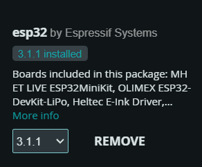

## Introduction

This guide walks you through setting up the
Arduino Integrated Development Environment (IDE)\
along with the necessary components for working with ESP32 boards.

It covers downloading the IDE, installing board managers,
and configuring your environment.

---

## Guide

### 1. Download and Install the Arduino IDE

- Visit the [Arduino Software page](https://www.arduino.cc/en/software).
- Download the version appropriate for your operating system
  (Windows, Mac OS, or Linux).
- Follow the installation instructions provided on the website.

### 2. Installing the ESP32 Board Manager

To work with ESP32-based boards, you need to install the ESP32 board manager:

### 3. General IDE Configuration

> [!note]
> The board configuration can be set automatically by pressing the
> `Get Board Info` button in the `Tools` tab.

- **Board:** ESP32S3 Dev Module
- **Upload Speed:** 921600
- **USB Mode:** Hardware CDC and JTAG
- **USB CDC On Boot:** Enabled
- **Upload Mode:** UART0 / Hardware CDC
- **CPU Frequency:** 240MHz (WiFi)
- **Flash Mode:** QIO 80MHz
- **Flash Size:** 16MB (128Mb)
- **Partition Scheme:** 16M Flash (2MB APP/12.5MB FATFS)
- **Core Debug Level:** (Select your preferred level)
- **PSRAM:** QSPI PSRAM
- **Arduino Runs On:** Core 1
- **Events Run On:** Core 1
- **Erase All Flash Before Sketch Upload:** Enabled
- **JTAG Adapter:** Integrated USB JTAG
- **Zigbee Mode:** Disabled
